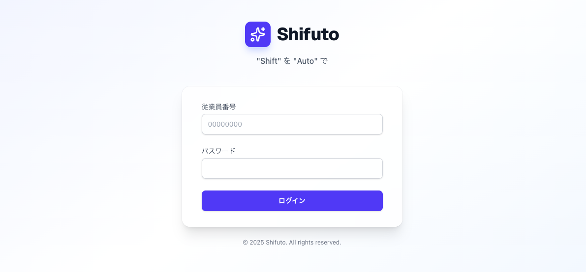
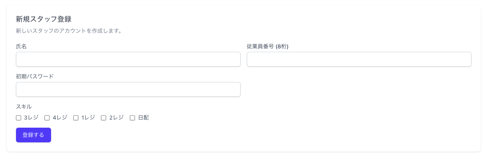
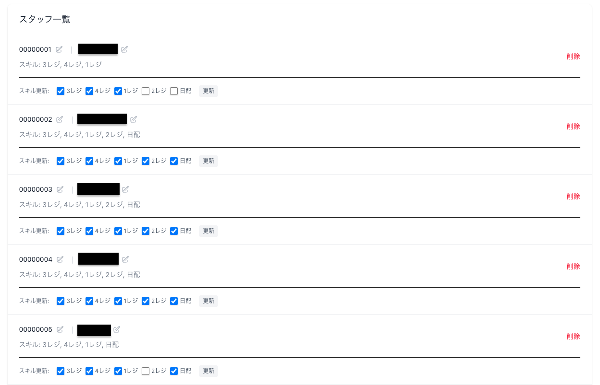
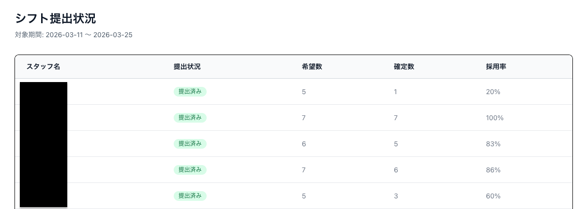
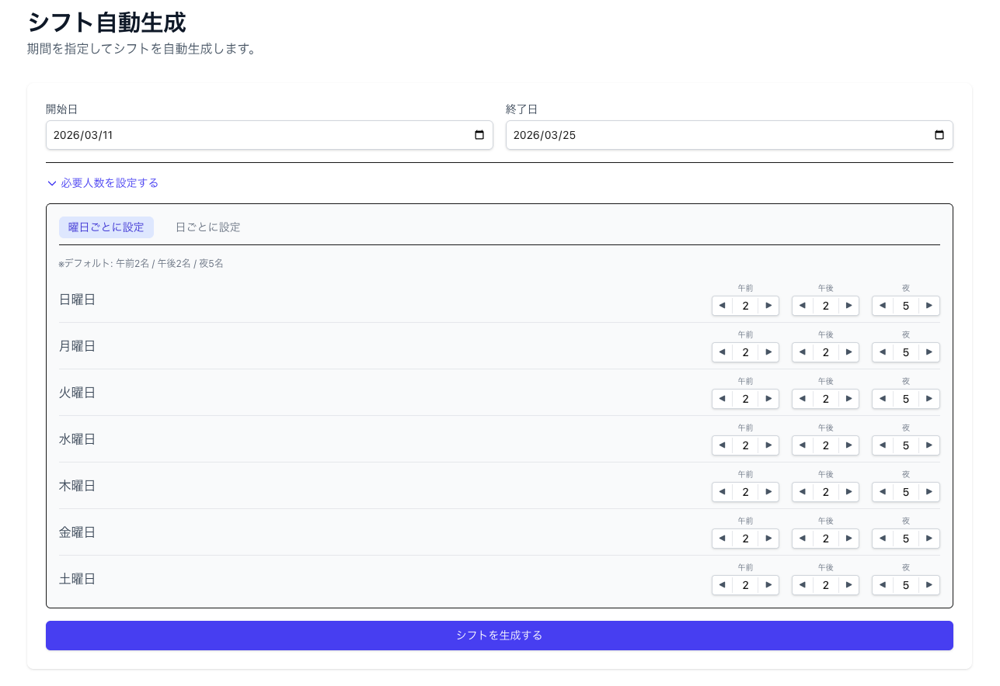
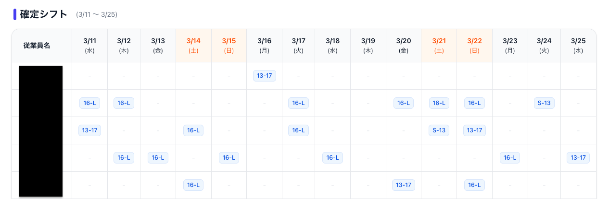
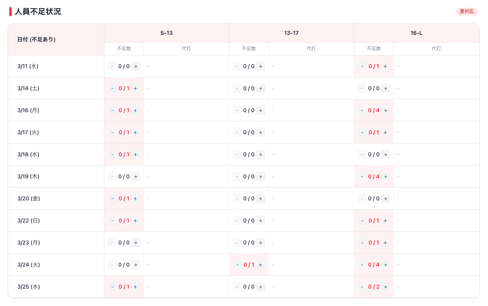

# Shifuto 管理者用総合マニュアル

このドキュメントは、シフト管理アプリケーション「Shifuto」の管理者向け包括的マニュアルです。システムの技術的構造、セキュリティ、運用コスト、および具体的な操作手順について解説します。

---

## 目次

1. システム概要
2. 技術スタック詳細
3. シフト自動生成アルゴリズム
4. セキュリティとアーキテクチャ
5. 運用コストとインフラ
6. 管理者操作ガイド
7. トラブルシューティング
8. システム保守ガイド

---

## 1. システム概要

Shifutoは、アルバイトスタッフのシフト希望を収集し、アルゴリズムを用いて最適なシフト表を自動生成するWebアプリケーションです。

### 主な機能

- **シフト希望収集**: スタッフはスマホやPCから簡単に希望を提出可能。
- **自動生成アルゴリズム**: 必要人数とスキル要件を考慮してシフトを自動作成。
- **確定・保存**: 自動生成結果を画像として出力・保存が可能。
- **不足管理**: 人員不足枠を可視化し、スタッフに追加募集をかけることが可能。

### 技術スタック概要

本システムは以下の技術で構成されています。

**フロントエンド**
- Next.js 15.x（App Router）: Webアプリケーションフレームワーク
- Tailwind CSS 3.x: スタイリングフレームワーク

**バックエンド・データベース**
- Supabase: PostgreSQLベースのBaaS（Backend as a Service）
- Supabase Auth: 認証・セッション管理

**言語・ホスティング**
- TypeScript 5.x: プログラミング言語
- Vercel: クラウドホスティングプラットフォーム

---

## 2. 技術スタック詳細

本システムで使用している各技術について、管理者・運用者向けに解説します。

### 2.1 Next.js（ネクストジェイエス）

**概要**: Next.jsは、Reactをベースにした**Webアプリケーションフレームワーク**です。Vercel社が開発・メンテナンスしています。

**本システムでの役割**:
- ユーザーが見る画面（UI）の構築
- サーバーサイドでのデータ取得・処理
- APIエンドポイントの提供

**主な特徴**:

- **App Router**: 最新のルーティング方式。フォルダ構造がそのままURLになる直感的な設計
- **Server Components**: サーバー側でHTMLを生成し、高速な初期表示を実現
- **Server Actions**: フォーム送信などをサーバーで直接処理。セキュアなデータ操作が可能
- **自動最適化**: 画像圧縮、コード分割、キャッシュなどを自動で行い高速化

**選定理由**:
- Vercelとの親和性が高く、デプロイが簡単
- サーバーとクライアントの両方の処理を1つのコードベースで管理可能
- 企業での採用実績が多く、長期的なサポートが期待できる

---

### 2.2 TypeScript（タイプスクリプト）

**概要**: TypeScriptは、JavaScriptに**静的型付け**を追加したプログラミング言語です。Microsoft社が開発しています。

**本システムでの役割**:
- すべてのソースコードの記述言語
- コンパイル時のエラー検出によるバグ防止

**主な特徴**:

- **型安全性**: 変数やデータの「型」を定義することで、実行前にエラーを発見
- **コード補完**: エディタが文脈を理解し、入力候補を表示
- **リファクタリング**: 変数名の変更などを安全に一括適用可能
- **ドキュメント性**: 型定義がそのままコードの仕様書になる

---

### 2.3 Tailwind CSS（テイルウィンドCSS）

**概要**: Tailwind CSSは、**ユーティリティファースト**のCSSフレームワークです。小さなクラスを組み合わせてデザインを構築します。

**本システムでの役割**:
- 画面のデザイン・レイアウト
- レスポンシブ対応（PC/スマホ両対応）

**主な特徴**:

- **ユーティリティクラス**: 直感的なクラス名でスタイルを適用
- **レスポンシブ**: 画面サイズ別の制御が容易
- **カスタマイズ**: 設定ファイルで色やサイズを自由に定義可能
- **軽量化**: 使用しているクラスのみを本番ビルドに含める

---

### 2.4 Supabase（スーパベース）

**概要**: Supabaseは、**オープンソースのFirebase代替**として知られるBaaS（Backend as a Service）です。PostgreSQLをベースにしています。

**本システムでの役割**:
- **データベース**: スタッフ情報、シフト希望、確定シフトなどを保存
- **認証**: ログイン・ログアウト、パスワード管理
- **リアルタイム**: データ変更の即時反映（本システムでは限定的に使用）

**主要コンポーネント**:

- **PostgreSQL**: 世界で最も信頼されているオープンソースのリレーショナルデータベース
- **Supabase Auth**: メール/パスワード認証、セッション管理を提供
- **Row Level Security (RLS)**: データベースレベルでのアクセス制御
- **Supabase Dashboard**: Webブラウザからデータベースを管理できる管理画面

**データベース構造**:

- **profiles**: ユーザー情報（名前、ロール、従業員番号）
- **shift_requests**: シフト希望（誰が、いつ、どの時間帯を希望）
- **shift_assignments**: 確定シフト（最終的な出勤予定）
- **time_slots**: 時間帯マスタ（S-13, 13-17, 16-L など）
- **skills**: スキルマスタ（3レジ、日配など）
- **user_skills**: ユーザーとスキルの紐付け
- **daily_headcounts**: 日ごとの必要人数設定

---

### 2.5 Vercel（ヴァーセル）

**概要**: Vercelは、Next.jsを開発している会社が提供する**クラウドホスティングプラットフォーム**です。

**本システムでの役割**:
- アプリケーションの公開（ホスティング）
- 自動デプロイ（GitHubにコードをプッシュすると自動更新）
- SSL証明書の自動管理（https通信）

**主な特徴**:

- **ゼロ設定デプロイ**: Next.jsプロジェクトをそのままデプロイ可能
- **エッジネットワーク**: 世界中のサーバーからコンテンツを配信し高速化
- **プレビュー環境**: ブランチごとに自動でプレビューURLを生成
- **分析機能**: アクセス数やパフォーマンスを可視化

**デプロイの流れ**:
開発者がコード変更 → GitHubにプッシュ → Vercelが自動検知 → ビルド＆デプロイ → 数分で反映

---

### 2.6 システム構成図

本システムは3層構造で構成されています。

**第1層: ユーザー（ブラウザ）**
- PC / スマートフォンのWebブラウザからアクセス
- HTTPS通信で安全に接続

**第2層: Vercel（アプリケーションサーバー）**
- Next.jsアプリケーションをホスティング
- Server Components（画面生成）
- Server Actions（データ操作）
- API Routes（外部連携）

**第3層: Supabase（バックエンド）**
- PostgreSQL（データベース）
- Supabase Auth（認証）
- Storage（ファイル保存）

通信フロー: ユーザー → Vercel → Supabase → Vercel → ユーザー

---

## 3. シフト自動生成アルゴリズム

本システムの中核となるシフト自動生成アルゴリズムについて解説します。

### 3.1 アルゴリズム概要

シフト生成は**ランダム探索型最適化アルゴリズム**を採用しています。多数のパターンを試行し、最もスコアの高い組み合わせを選択します。

**基本フロー**:
1. 対象期間内の各日付に対して処理を実行
2. その日のシフト希望を収集
3. 連続勤務日数の制限をチェック
4. 複数パターンを試行してスコアを計算
5. 最高スコアのパターンを採用

### 3.2 制約条件

アルゴリズムは以下の制約を考慮します。

**連続勤務制限**:
- 最大5日間連続勤務まで
- 6日目以降は自動的に休みとなる

**時間帯の分割**:
- 1日を3つの時間帯（午前・午後・夜間）に分割
- 各時間帯に必要人数を設定

**シフトの柔軟な割り当て**:
- ロングシフト（S-17, 13-L, S-L）は分割可能
- 例: S-17希望 → S-13 または 13-17 に分割される場合がある
- これにより人員配置の最適化が可能

### 3.3 スコアリング

各パターンは以下の基準でスコアリングされます。

**人員不足ペナルティ（重要度: 最高）**:
- 必要人数に対して不足がある場合、大きな減点
- 不足1人あたり -10,000点

**スキルカバレッジ（重要度: 高）**:
- 各時間帯で必要なスキル（3レジ、4レジ、1レジ、2レジ、日配）がカバーされているか
- カバーされているスキル1つあたり +100点
- 全5スキルカバーで最大 +500点/時間帯

**過剰人員ペナルティ（重要度: 低）**:
- 必要人数を超えて配置した場合、軽微な減点
- 過剰1人あたり -10点

### 3.4 探索回数

各日付について**2,000パターン**を試行し、最高スコアのパターンを採用します。これにより、実用的な計算時間内で良好な解を得ることができます。

### 3.5 時間帯の定義

本システムで使用する時間帯は以下の通りです。

- **S-13**: 開店〜13時（午前シフト）
- **13-17**: 13時〜17時（午後シフト）
- **16-L** / **17-L**: 16時または17時〜閉店（夜間シフト）
- **S-17**: 開店〜17時（午前+午後）
- **13-L**: 13時〜閉店（午後+夜間）
- **S-L**: 開店〜閉店（全日、分割して割り当て）

### 3.6 必要人数のデフォルト設定

- 午前（morning）: 2名
- 午後（afternoon）: 2名
- 夜間（night）: 5名

これらの値は管理画面から日ごと・曜日ごとにカスタマイズ可能です。

---

## 4. セキュリティとアーキテクチャ

本システムは、堅牢なセキュリティモデルに基づいて設計されています。

### 認証と認可 (Authentication & Authorization)

- **Supabase Auth**: ユーザー認証にはSupabase Authを使用しており、パスワードはハッシュ化されて安全に保存されます。
- **ロールベースアクセス制御 (RBAC)**: ユーザーは「管理者 (admin)」と「スタッフ (staff)」のいずれかのロールを持ちます。
- **Row Level Security (RLS)**: データベースレベルでアクセス制御を行っています。

**スタッフの権限**:
- 自分のシフト希望・確定シフトのみ閲覧・編集可能
- 他人の個人情報は閲覧不可

**管理者の権限**:
- 全データの閲覧・編集が可能

### データ保護

- 通信はすべてSSL/TLSにより暗号化されています。
- データベースへの直接アクセスは制限されており、API経由でのみ操作が行われます。

---

## 5. 運用コストとインフラ

本アプリはクラウドサービス（VercelおよびSupabase）上で動作します。

### 運用方針とコスト試算

本アプリは、**完全無料枠（Free Tier）** での運用を前提として設計されています。

**想定アクセス規模**:
- 従業員数: 約20名（変動なし）
- 利用頻度: 月2回（半月に一度のシフト提出時）
- 管理者アクセス: 月数回のシフト作成時のみ

この規模であれば、VercelおよびSupabaseの無料プランの制限内で十分に運用可能です。

**運用コスト**:

- **Webホスティング（Vercel Hobby）**: 無料（個人・非営利利用の範囲内）
- **データベース（Supabase Free）**: 無料（500MBまで、十分な容量）

### 無料枠運用における注意点

SupabaseのFreeプランでは、**1週間アクセスがないとプロジェクトが一時停止**します。

**対策**: 管理者またはスタッフが定期的にログインすることで停止を防げます。

**停止した場合**: 管理者がSupabaseのダッシュボードにログインして「Restore」ボタンを押すことで、数分で復旧します。データが消えることはありません。

---

## 6. 管理者操作ガイド

### 初回ログイン情報

システム導入時の初期管理者アカウントは以下の通り設定されています。ログイン後、速やかにパスワードを変更してください。

- **従業員番号**: 00000020
- **パスワード**: csd00000020

### 6.1 スタッフ管理

管理画面の「スタッフ管理」から行います。リストは **従業員番号順** に表示されます。

**スタッフ登録**:
新しいスタッフのアカウントを作成します。従業員番号と初期パスワードを設定します。従業員番号はシステム内部でのみ使用され、実際のメールアドレスとしては利用されません。

**スキル設定**:
各スタッフのスキル（例: 3レジ、日配など）を設定します。これが自動生成時の割り当て基準になります。

**削除**:
退職したスタッフのアカウントを削除できます。

### 6.2 シフト作成フロー

毎月のシフト作成は以下の手順で行います。

**手順1: 提出状況の確認**

「提出状況」ページで、スタッフの提出状況を確認します。リストは従業員番号順に並んでいます。シフト作成後にこのページで各スタッフがそれぞれの希望に対してどの程度出勤予定かを「採用率」として表示します。

**手順2: シフト自動生成**

「シフト作成」ページを開きます。対象期間が自動設定されていることを確認します。パートタイム労働者の出勤状況に応じたアルバイトの必要人数の調整を行うことができます（曜日ごと/日ごとで設定可能）。「生成」ボタンをクリックすると、アルゴリズムが最適な配置を計算します。

**手順3: 結果の確認と調整**

生成されたシフト表が表示されます。赤く表示されている日は人員が足りていません。シフト表のセル（マス目）をクリックまたはタップすることで、そのスタッフのシフトを直接追加・削除できます。

**手順4: 確定と保存**

内容に問題がなければ「この内容で確定する」をクリックします。これによりスタッフにシフトが公開されます。

**手順5: 画像出力**

「画像として保存」ボタンを押すと、シフト表が画像ファイルとしてダウンロードされます。LINEグループ等での共有に利用してください。

### 6.3 不足シフトの対応

確定後、人員不足がある日はトップページの「人員不足状況」に表示されます。スタッフはこの表を見て、不足枠に応募（クリックしてシフトイン）することができます。

**管理者機能**:
管理者は不足数（必要人数）を直接調整できます。

- **+ボタン**: 必要人数を増やし、不足数を1つ増やします（追加募集したい場合など）
- **-ボタン**: 必要人数を減らし、不足数を1つ減らします（募集を締め切りたい場合など）

---

## 7. トラブルシューティング

**Q. 画像生成時にエラーが出る**

A. ブラウザのバージョンが古い可能性があります。最新のChromeまたはSafariを使用してください。また、モバイル端末ではメモリ不足で生成できない場合があります。その場合はPCから行ってください。

**Q. スタッフがログインできない**

A. 従業員番号とパスワードが正しいか確認してください。パスワードを忘れた場合は、管理者が一度そのユーザーを削除し、再登録する必要があります。

**Q. 自動生成でどうしても不足が出る**

A. 設定されている「必要人数」に対して、提出されている希望シフトの総数が足りていない可能性があります。スタッフに追加の出勤をお願いするか、必要人数設定を見直してください。

**Q. アプリにアクセスできない / 「サービスが停止しています」と表示される**

A. Supabaseの無料プランでは、1週間以上アクセスがないとプロジェクトが一時停止します。Supabaseダッシュボード（https://supabase.com/dashboard）にログインし、該当プロジェクトの「Restore」ボタンを押してください。

---

## 8. システム保守ガイド

### 8.1 定期的なメンテナンス

**週1回以上**: アプリにログインしてSupabase停止を防止

**月1回**: ユーザー一覧を確認し、退職者の削除や新規登録の確認を行う

**半年に1回**: パスワード変更を推奨してセキュリティを維持

### 8.2 バックアップについて

- **Supabase**: データベースは自動的にバックアップされています（無料プランでは7日間保持）
- **コード**: GitHubリポジトリに保存されており、履歴管理されています

### 8.3 緊急連絡先・リソース

- **Supabase Dashboard**: https://supabase.com/dashboard
- **Vercel Dashboard**: https://vercel.com/dashboard
- **GitHub リポジトリ**: https://github.com/Yota109/Shifuto-app
- **本番アプリURL**: Vercelでデプロイ後のURL

### 8.4 管理者の引き継ぎ時に必要な情報

新しい管理者に引き継ぐ際は、以下の情報を安全に共有してください：

1. アプリのログイン情報（管理者用従業員番号・パスワード）
2. Supabaseのログイン情報（メールアドレス・パスワード）
3. Vercelのログイン情報（必要に応じて）
4. GitHubのアクセス権限（コード変更が必要な場合）

**セキュリティ注意**: これらの情報は口頭または暗号化されたチャンネルで共有し、平文のメールやチャットで送信しないでください。
